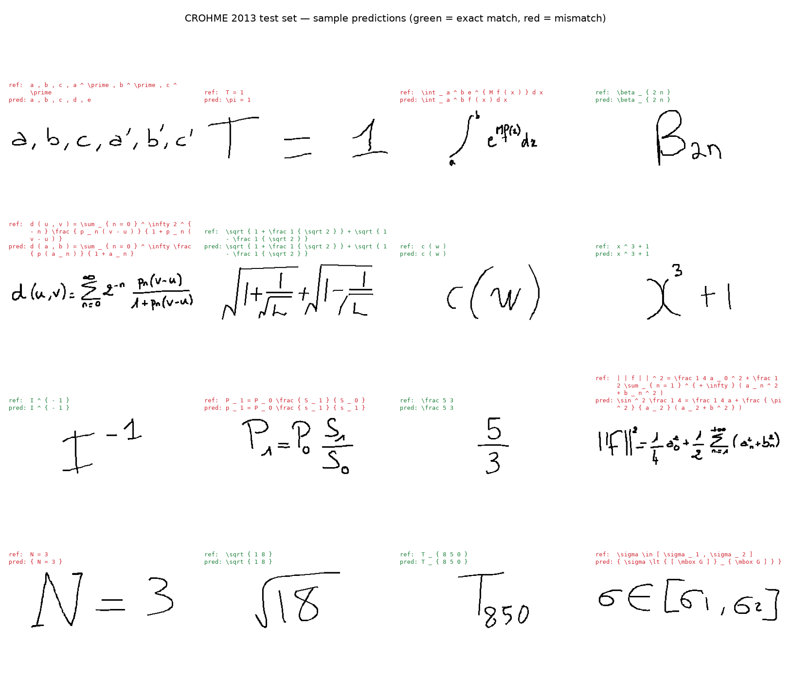
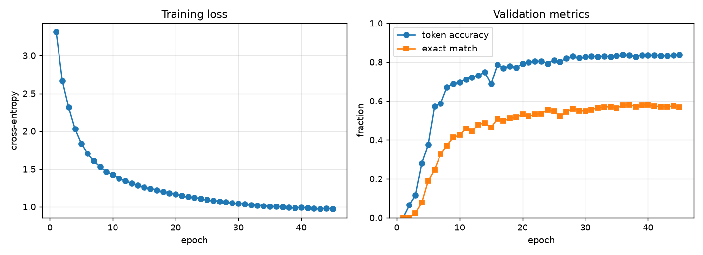
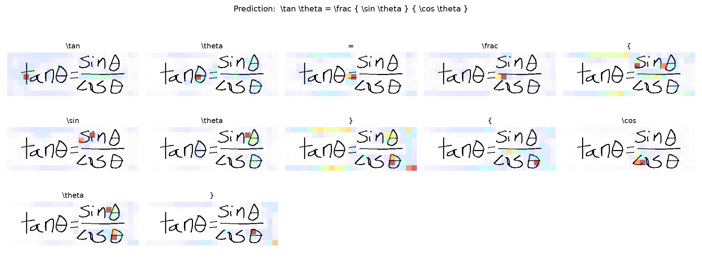

# Handwritten Equation Recognizer — CROHME, Image-to-LaTeX

Reads an image of a handwritten mathematical expression and outputs its
LaTeX transcription: a ResNet CNN encoder + Transformer decoder, in the
spirit of *Watch, Attend and Parse* / show-attend-and-tell captioning.

Instead of segmenting an expression into individual symbols and
classifying each one, a single model looks at the whole equation image and
generates the LaTeX string directly, token by token, attending to a
different region of the image as it writes each symbol.



## Results

ResNet-18 encoder + 4-layer Transformer decoder, 7.3M parameters. Trained
on the CROHME 2013 training set (7,947 expressions after de-duplication),
45 epochs on an Apple M2 (MPS), ~1.9 h.

| Split | Decoding | Exact match | Token accuracy |
|-------|----------|:-----------:|:--------------:|
| Validation (held-out, same sub-corpora as train) | greedy | 57.7% | 83.7% |
| **Official CROHME 2013 test set** (unseen writers) | greedy | 14.5% | 46.3% |
| **Official CROHME 2013 test set** | beam search (k=5) | **16.5%** | **50.1%** |

*Exact match* = the whole predicted token sequence is identical to the
reference (the headline CROHME metric). *Token accuracy* =
`1 − Levenshtein(pred, ref) / |ref|`, a partial-credit view.

Test-set exact match by expression length (greedy):

| Reference length | 1–3 tokens | 4–7 | 8–15 | 16+ |
|---|:---:|:---:|:---:|:---:|
| Exact match | 38% | 23% | 9% | 1% |

The model reads individual symbols and local structure well; errors
compound over long expressions. The gap between validation (58%) and the
official test set (16%) is **writer overfitting** — CROHME's test writers
are disjoint from its training writers, and a model this size still keys
partly on writer-specific stroke style. Narrowing it further is the main
open problem (see *Next steps*).

### GRU vs Transformer decoder

Both decoders sit on the same ResNet encoder and training data. The GRU +
Bahdanau-attention decoder (`checkpoints/gru_best.pt`, 3.6M params) was the
v1; the Transformer decoder (`checkpoints/best.pt`) is v2.

| Decoder | Val exact | Test exact (beam) | Test token-acc (beam) |
|---------|:---------:|:-----------------:|:---------------------:|
| GRU + Bahdanau attention | 56.8% | 10.9% | 43.9% |
| **Transformer (4 layers)** | **57.7%** | **16.5%** | **50.1%** |

Near-identical on validation, but the Transformer generalizes markedly
better to unseen writers (+5.6 pts exact, +6 pts token accuracy on the
official test set) and improves in every length bucket. Label smoothing
(0.1) in the Transformer run is part of that.



### Attention

The Transformer decoder's cross-attention over the image as it emits each
token of `\tan \theta = \frac { \sin \theta } { \cos \theta }` — it tracks
left-to-right (and into the numerator / denominator) and lands on the
symbol it is transcribing:



## What actually moved the needle

The first working version scored **~1% exact match** on the official test
set despite 50% on training data — a textbook overfitting / setup failure.
Fixing it, in rough order of impact:

1. **ImageNet-pretrained ResNet-18 encoder** (through `layer3`) instead of
   a from-scratch CNN. Pretrained edge/stroke/curvature filters transfer
   to handwriting the model has never seen; a from-scratch encoder just
   memorized the training writers. **+ a BatchNorm after the feature
   projection** — the pretrained backbone's raw activations are
   low-variance (std ≈ 0.15) on near-binary handwriting, which starved the
   attention mechanism and stalled training entirely until normalized.
2. **Transformer decoder** (4 layers) replacing the GRU + Bahdanau
   decoder, with label smoothing 0.1. Same validation accuracy, but +5.6
   pts exact match on the official test set — it generalizes to unseen
   writers noticeably better (see the table above).
3. **Aspect-preserving 128×384 renders** instead of 128×128 squares. Math
   expressions have a median aspect ratio ~3:1; a square canvas crushed
   long ones to a few pixels of height.
4. **Deterministic LR schedule** (linear warmup → cosine decay) instead of
   `ReduceLROnPlateau`. The plateau scheduler, fed a noisy free-running
   decode metric, drove the LR to ~2e-5 by epoch 20 and the model
   undertrained.
5. **Aggressive augmentation** (affine + perspective + stroke
   erosion/dilation + speckle) and **dropout + weight decay** — a stand-in
   for the writer variation the model needs to be robust to.

## Approach

```
equation image  (1 × 128 × 384, aspect-preserving)
        │
        ▼
  ResNet-18 encoder     conv1+bn1 frozen · layer1–3 fine-tuned · 1×1 proj + BN + ReLU
        │                                            → 256 × 8 × 24 feature grid
        ▼
  192 memory tokens  (the 8×24 grid, flattened, + learned positions)
        │
        ▼
  Transformer decoder   4 layers · 8 heads · d_model 256 · pre-norm
        │  masked self-attention over tokens produced so far, then
        │  cross-attention over the 192 image tokens; emit over the
        │  118-token vocab
        ▼
  LaTeX token sequence   \frac { a } { b } …
```

- **Encoder** — `torchvision` ResNet-18, ImageNet weights, truncated after
  `layer3`; `conv1`/`bn1` frozen, the rest fine-tuned at 0.25× the base
  LR. 1×1 conv projects 256→256, then BatchNorm + ReLU.
- **Decoder** — 4 pre-norm Transformer decoder layers (`d_model` 256, 8
  heads, FFN 1024, dropout 0.2), learned token + 2D-ish memory positional
  embeddings. The older GRU + Bahdanau decoder is still selectable
  (`--decoder gru`).
- **Training** — cross-entropy with label smoothing 0.1, AdamW (wd 5e-5),
  grad clipping, linear-warmup → cosine LR, augmentation on the train
  split only.
- **Inference** — batched greedy, or length-normalized beam search.

## Data

`data/CROHME_full_v2.zip` bundles the CROHME 2011–2013 competition
releases (~13k `.inkml` online-handwriting files, each with a ground-truth
LaTeX label). `preprocess.py` uses the clean **CROHME 2013 split**
(`TrainINKML` for train/val, `TestINKMLGT` for test) and:

- **de-duplicates by stroke-content hash** — the releases overlap heavily
  year-to-year and every test set ships with a duplicate labelled copy, so
  a naive glob triples parts of the data and leaks test expressions into
  training (6 in-corpus dupes dropped here; the cross-year overlap is much
  larger if you pull in 2011/2012);
- renders each stroke sequence to a 128×384 bitmap, aspect preserved;
- **canonicalizes labels** — strips `$…$`, drops `\left`/`\right`, and
  removes braces around single atoms so `x^{2}`, `x ^ 2` and `x^2` all
  tokenize to the same 3 tokens (the biggest source of label noise across
  the combined sub-corpora, which each follow their own conventions);
- builds the vocabulary from the training split (min frequency 2 → 118
  tokens).

Result: 7,947 train / 882 val / 668 test.

## Setup

```bash
python3 -m venv venv
source venv/bin/activate
pip install -r requirements.txt
python src/fetch_pretrained.py   # only if torchvision's auto-download hits an SSL error
```

`requirements.txt` pins `torch==2.2.2` — newer wheels need macOS 14+ for
MPS. Runs on CUDA, Apple-Silicon MPS, or CPU (auto-detected).

## Usage

```bash
cd src

# 1. Preprocess: parse InkML, render, build vocab, write CSV splits
#    (unzip data/CROHME_full_v2.zip into data/extracted first)
python preprocess.py --data_root ../data/extracted/CROHME_full_v2 \
    --out_dir ../data/processed --image_w 384 --image_h 128

# 2. Train (Transformer decoder by default; --decoder gru for the v1 model)
python train.py --data_dir ../data/processed --epochs 45 --batch_size 24 --augment \
    --lr 4e-4 --label_smoothing 0.1

# 3. Evaluate on the official test set: metrics + per-example predictions + error patterns
python evaluate.py --checkpoint ../checkpoints/best.pt \
    --data_dir ../data/processed --split test --beam_size 5

# 4. Figures
python plot_history.py
python make_demo_grid.py --data_dir ../data/processed
python visualize_attention.py --checkpoint ../checkpoints/best.pt \
    --vocab ../data/processed/vocab.json \
    --image ../data/processed/images/<a-test-image>.png

# 5. Predict on a single image (a render, or a photo of your own handwriting)
python predict.py --checkpoint ../checkpoints/best.pt \
    --vocab ../data/processed/vocab.json --image path/to/equation.png --beam_size 5
```

## Project layout

| File | Purpose |
|------|---------|
| `src/inkml_parser.py` | Parse `.inkml` → strokes + canonicalized LaTeX tokens |
| `src/render.py` | Rasterize strokes → grayscale bitmap |
| `src/vocab.py` | Build / load the token vocabulary |
| `src/preprocess.py` | InkML → images + `{train,val,test}.csv` + `vocab.json` |
| `src/dataset.py` | `Dataset`, padding collate, train-time augmentation |
| `src/model.py` | ResNet encoder; Transformer and GRU+attention decoders; beam search |
| `src/train.py` | Training loop, LR / label-smoothing / schedule, metric logging |
| `src/metrics.py` | Exact match + edit-distance token accuracy |
| `src/evaluate.py` | Full test-set evaluation + Levenshtein error-pattern analysis |
| `src/predict.py` | Single-image inference |
| `src/visualize_attention.py` | Per-token attention overlays |
| `src/plot_history.py` | Training curves |
| `src/make_demo_grid.py` | Portfolio montage of test predictions |
| `src/fetch_pretrained.py` | Fetch ResNet-18 weights when auto-download fails |

## Next steps

- **Close the writer-overfitting gap** — still the main lever (val 58% vs
  test 16%). Stroke-level augmentation (perturb control points before
  rendering, not just the rasterized image) and writer-normalized
  rendering are the most promising, since the archive itself has little
  extra writer diversity.
- **Coverage / repetition penalty** at decode time — the long-expression
  collapse (1% exact at 16+ tokens) is partly dropped and repeated
  sub-terms.
- **Bigger decoder / encoder through `layer4`** (512-d) — the model is
  small (7M) and still fits its capacity.
- **KV-cache the Transformer decode** — inference re-runs the full stack
  per step; caching would make beam search ~10× faster.
- **Evaluate on CROHME 2014/2016/2019** for numbers directly comparable to
  published work.
- Train on the online stroke sequences directly (a 1-D encoder) rather
  than rendered bitmaps — the strokes are the real signal.

## Citation

CROHME: Competition on Recognition of Online Handwritten Mathematical
Expressions (Mouchère et al.; Mahdavi et al.). Bundled data combines the
2011–2013 competition releases.
